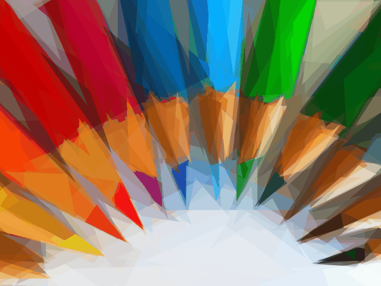

# nodejs-primitive

This is nodejs port of the https://primitive.lol app, originally created by Michael Fogleman (written in go). Its purpose is to reproduce images with geometric primitives. This implementation is slower than original one, but is fast enough to be usable.

### How it Works

You can find some technical information about the algorithm in the [GitHub repository](https://github.com/fogleman/primitive) of original go app.

### Dependencies

- `sharp` - High performance node.js image processing library. Uses the `libvips` library.
- `gif-encoder` - Streaming GIF encoder. Used to save static and animated gifs.
- `minimist` - Parse argument options for termianal app.
- `tty-table` - Table generator for terminal app help message.

### Command-line Usage

#### Install

    git clone https://github.com/rossinek/nodejs-primitive.git
    cd nodejs-primitive
    npm install -g

#### Usage

Usage: `node-primitive [options] -i string -o string`

Options:

|   Flag   |   Default   |   Description |
|---|---|---|
| -i, --input | required | input image path (supported image types: jpg, jpeg, svg, gif, png, webp, tiff) |
| -o, --output | required | output image path (supported image types: jpg, jpeg, svg, gif, png, webp, tiff) |
| -n, --number | 15 | number of primitives |
| -a, --alpha | 128 | alpha value for primitive |
| --resize-input | 128 | resize input images to this size |
| --resize-output | input image size | output image size |
| -r, --repeat | 0 | add N extra shapes per iteration with reduced search |
| -f, --frames | 1 | if greater than 1 then output format should be gif and animation mode should equal "random", then this value is the number of repeated random frames |
| --fps | 8 | frames per second for animated gif (if output format is not gif or frames equals 1 then ignored) |
| --animation-mode | "random" | animation mode for animated gif, can be "random" or "progressive", ignored for other output formats |
| -b, --blur | 0 | gaussian blur standard deviation, if equals 0 then no blur is applied; blur is applied to output image |
| -h, --help | off | print help message |
| -v, --verbose | off | verbose show application logs |
| -w, --very-verbose | off | show more application logs |

### Output Formats

Depending on the output filename extension, you can produce different types of output.

- `png`, `jpg`, `tiff`, `webp` - raster output
- `svg` - vector output
- `gif` - animated output

### Animation mode

Animation mode for gif output can be set to "random" or "progressive". Progressive animation demonstrates the iterative nature of the algorithm, by adding one shape at a time. Random animation demonstrates the random nature of the algorithm - each frame contains the same number of primitives.
